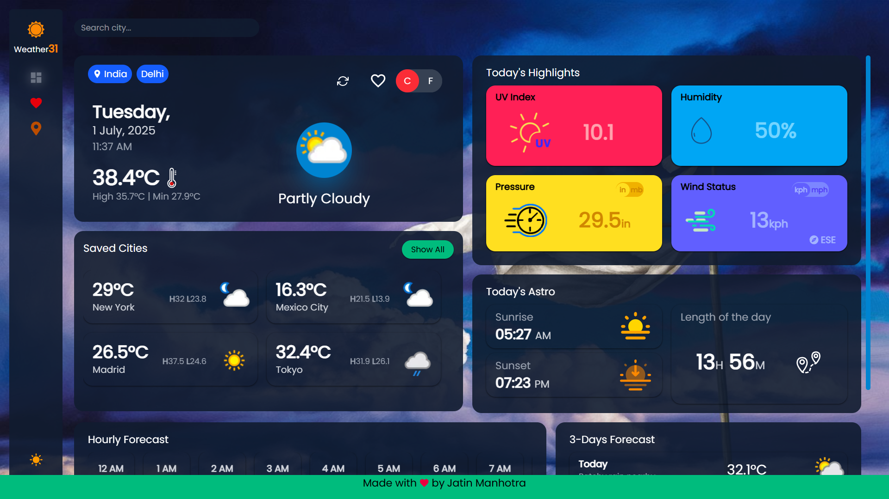
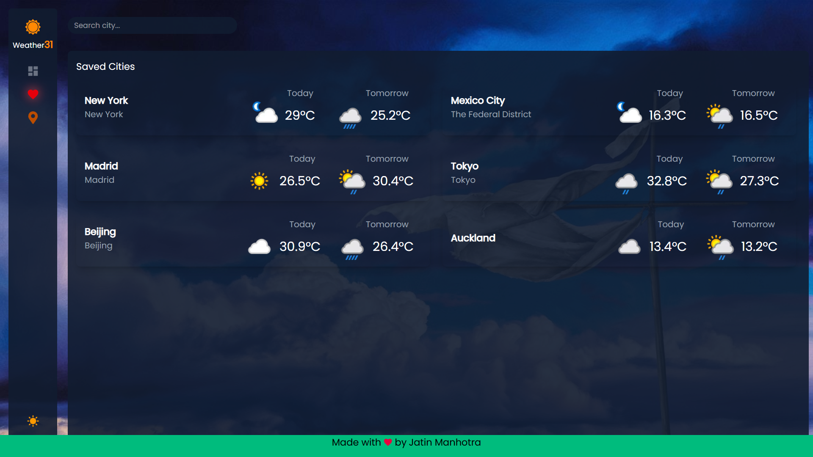
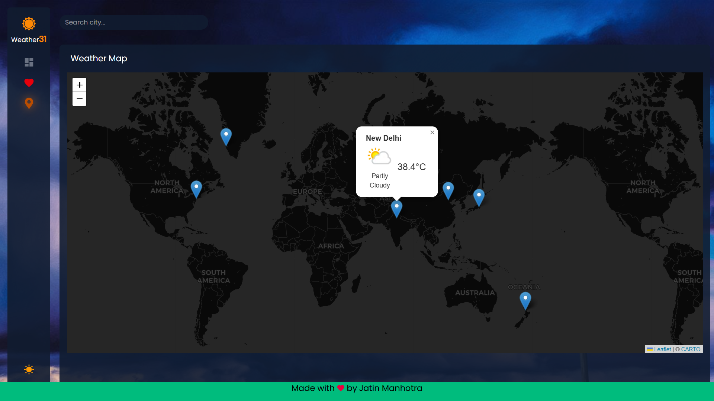

# ⛅ Weather Dashboard App

A responsive **React-based** weather dashboard that lets users search any city and view real-time weather, 3-day and hourly forecasts, and interact with a Leaflet map displaying **saved locations**. Features include dark mode, persistent storage via localStorage, and smooth client-side routing using React Router.

---

## 🚀 Live Demo

👉 Check out here - [Weather Dashboard](https://jatinmanhotra.github.io/react-weather-app/#/dashboard)

---

## 📸 Screenshots

### 🏠 Dashboard  

### 💾 Saved Cities  

### 📍 Weather Map  

---

## 🔧 Tech Stack

- **React.js** - Functional component-based frontend
- **React Router DOM** - Seamless page navigation
- **Tailwind CSS** - Utility-first CSS styling
- **React Icons** - Icon library
- **Moment.js** - Date/time manipulation
- **React Leaflet** - Interactive maps with markers
- **WeatherAPI.com** - Real-time weather and forecast data

---

## 🔥 Features

### 🔍 City Search
- Search any city worldwide and fetch real-time weather data.
- See current temperature, weather conditions, and icons.
- 3-day forecast and hourly breakdown.

### 🌓 Dark Mode & UI
- Light/Dark toggle with persistent theme (via `localStorage`).
- Weather-based backgrounds (sunny, cloudy, rain, night, etc.).
- Animated transitions on load and search.

### 📍 Weather Map
- Uses **Leaflet.js** to display a dynamic map.
- Live interactive tiles from OpenStreetMap.
- View weather conditions with markers on a real map.
- Click any saved city to focus and see a weather popup.

### 📌 Saved Cities
- Displays weather previews for saved cities.
- Save and remove cities with a heart icon.
- All saved cities are stored in `localStorage`.
- Click on a saved city to load it instantly in the dashboard using React Router DOM.

### ⚙️ Other Functionalities
- Responsive layout for mobile, tablet, and desktop.
- LocalStorage sync on theme and saved cities.
- Loading states and error fallback handling.

---

## 🌱 Future Plans

- 📌 Add user geolocation detection on load.
- ⚠️ Show real-time weather alerts or warnings.
- 🧭 Add search history with autosuggestions.
- 🧠 AI-based weather assistant chatbot (using Gemini).
- 📦 Backend integration (for permanent storage & analytics).
- 🖼️ Add animations for weather conditions.
- 📲 Convert to PWA for installable mobile app.

---

## 📬 Contact Me

If you'd like to connect or collaborate, feel free to reach out:

- 🌐 [Portfolio](https://jatinmanhotra.github.io/portfolio-2025)
- 📧 Email: [jatinmanhotra31@gmail.com](mailto:jatinmanhotra31@gmail.com)
- 💬 [WhatsApp](https://wa.me/918493912066?text=Hi%20there%2C%20I%20saw%20your%20weather%20app!)
- 💼 [LinkedIn](https://www.linkedin.com/in/jatin-manhotra-5b474a347/)
- 💻 [GitHub](https://github.com/JatinManhotra)

---

## 🙌 Credits

- Weather data from [WeatherAPI.com](https://www.weatherapi.com/)
- Maps from [OpenStreetMap](https://www.openstreetmap.org/)
- Icons from [React Icons](https://react-icons.github.io/react-icons/)
- UI styling by [Tailwind CSS](https://tailwindcss.com/)